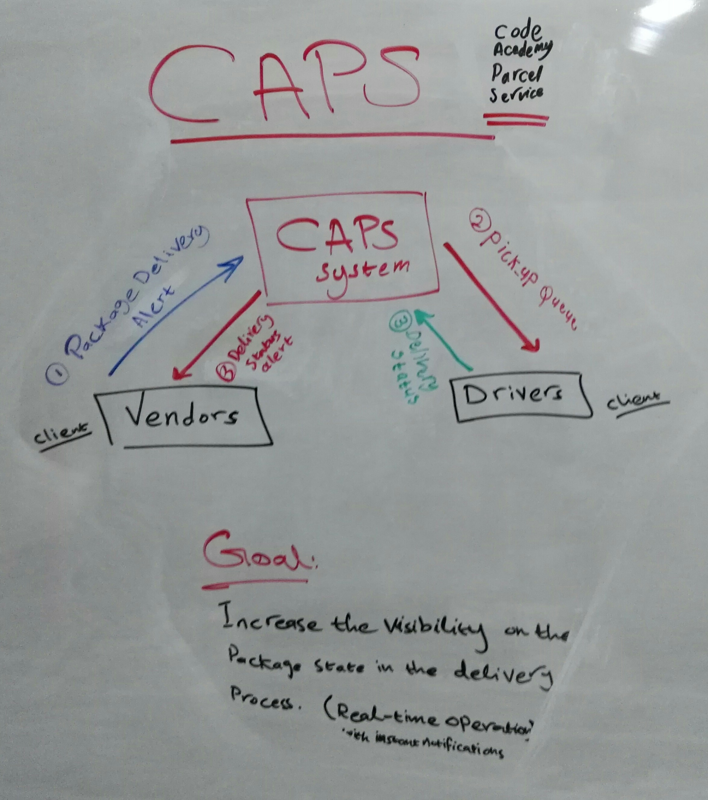

# CAPS - Hub Server (Code Academy Parcel Service)

## Author: Bushra Bilal

## Links and Resources:

- [PR]()
- [CI/CD - GH Actions]()

## Setup:

- `.env` variables:  
  `STORE_NAME='1-206-flowers'`

### How to run the app:

- Clone the app repo
- Run the command `npm i`
- Add the `.env` file and the enviroument variables
- Start the app by running the command `node caps.js`
- Run the test by the command `npm run test`

## UML:

